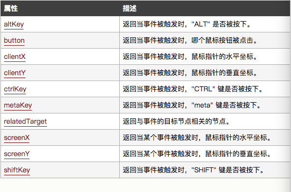
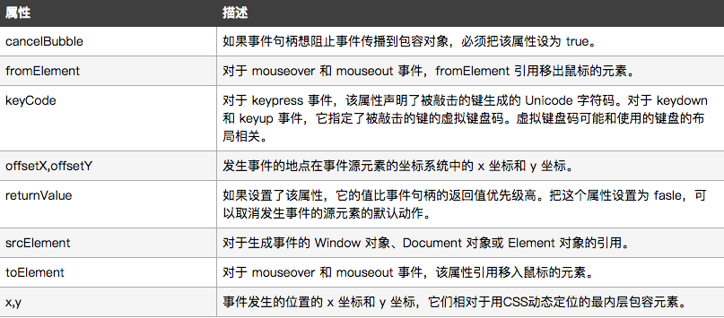
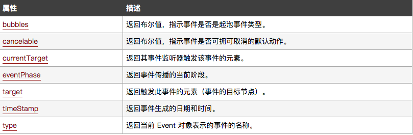

# HTML DOM Event 对象

Event对象代表事件的状态，比如事件在其中发生的元素、键盘按钮的状态、鼠标的位置、鼠标按钮的状态。     

事件通常与函数结合使用，函数不会在事件发生前被执行！     

## 事件句柄(Event Handlers)

HTML 4.0 的新特征之一是能够使HTML事件触发浏览器中的行为，比如当用户点击某个HTML元素时启动一段 JavaScript。下面是一个属性列表，可将之插入HTML标签以定义事件的行为。   

|属性                             | 此事件发生在何时...                                  |
| :------------------------------| :--------------------------------------------------|
| [onabort](http://www.w3school.com.cn/jsref/event_onabort.asp)| 图片的加载被中断。      |
|`onblur`        | 元素失去焦点。      |
|`onchang`       | 域的内容被改变。     |
|`onclick`       | 当用户点击某个对象时调用的事件句柄。 |
|`ondblclick`    | 当用户双击时某个对象时调用的事件句柄。  |
|`onerror`       | 在加载文档或图像时发生错误。   |
|`onfocus`       | 元素获得焦点。  |
|`onkeydown`     | 某个键盘按键被按下。  |
|`onkeypress`    | 某个键盘按键被按下并松开。  |
|`onkeyup`       | 某个键盘按键被松开  |
|`onload`        | 一张页面或一副图像完成加载。   |
|`onmousedown`   | 鼠标按钮被按下。   |
|`onmousemove`   | 鼠标被移动。   |
|`onmouseout`    | 鼠标从某元素移开。   |
|`onmouseover`   | 鼠标移到某元素之上。   |
|`onmouseup`     | 鼠标按键被松开。|
|`onreset`       | 重置按钮被点击。|
|`onresize`      | 窗口或框架被重新调整大小。  |
|`onselect`      | 文本被选中。   |
|`onsubmit`      | 确认按钮被点击。
|`onunload`      | 用户退出页面。  |

## 鼠标 / 键盘属性

## IE 属性

除了上面的属性/事件属性，IE浏览器还支持下面的属性：   

## 标准 Event 属性

## 标准 Event 方法

下面列出了 2 级 DOM 事件标准定义的方法。IE 的事件模型不支持这些方法：   

|属性                             | 描述                                 |
| :------------------------------| :--------------------------------------------------|
| initEvent()    | 初始化新创建的 Event 对象的属性。      |
| preventDefault()   | 通知浏览器不要执行与事件关联的默认动作。 |
| stopPropagation()   | 不再派发事件。    |

[参考文献](http://www.w3school.com.cn/jsref/dom_obj_event.asp)
